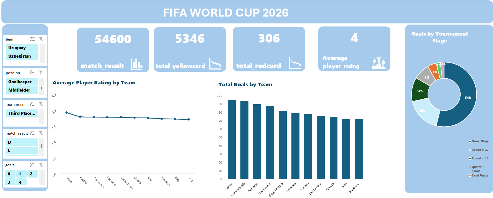

# ⚽ FIFA World Cup 2026 Player Performance Analysis

## 📌 Project Overview

This project analyzes FIFA World Cup 2026 player and team performance data to identify key statistics, compare players and teams, and explore performance patterns through an interactive Excel dashboard.

The project focuses on transforming raw football data into clear and meaningful insights using Microsoft Excel.

## 🛠️ Tools & Techniques Used

* Microsoft Excel
* Data Cleaning & Preparation
* Pivot Tables
* Pivot Charts
* Slicers
* KPI Calculations
* Data Analysis
* Dashboard Design

## 📊 Dashboard

The interactive dashboard provides an overview of player and team performance and allows the data to be explored through different filters and performance metrics.

### Dashboard Preview



## 🔎 Key Analysis

The project includes analysis of:

* Player performance and statistics
* Team performance
* Goals and assists
* Matches and appearances
* Minutes played
* Yellow cards
* Player positions
* Team-level statistics
* Player and team comparisons
* Performance-related KPIs

## 📈 Performance Analysis

The dashboard was designed to compare players and teams based on different performance metrics and identify the players and teams that stand out across the dataset.

Yellow card statistics were also analyzed to understand disciplinary patterns among players and teams.

## 💡 Key Insights

The analysis helps identify:

* Top-performing players
* Players with the highest goal and assist contributions
* Teams with stronger overall performance
* Players with higher playing time and appearances
* Yellow card patterns across players and teams
* Performance differences between player positions
* Key trends across different performance metrics

## 🎯 Project Goal

The main goal of this project was to practice working with sports performance data and develop an interactive Excel dashboard that can be used to explore player and team statistics.

This project helped strengthen my practical skills in **Excel, data analysis, Pivot Tables, Pivot Charts, KPI calculation, and dashboard development**.

## 📁 Project Structure

```text
FIFA-World-Cup-2026-Player-Performance-Analysis/
│
├── FIFA_World_Cup_2026.xlsx
├── dashboard.png
└── README.md
```

## 👩‍💻 Author

**Aysel Hasanova**

Data Analytics  | SQL | Python | Pandas | Excel
